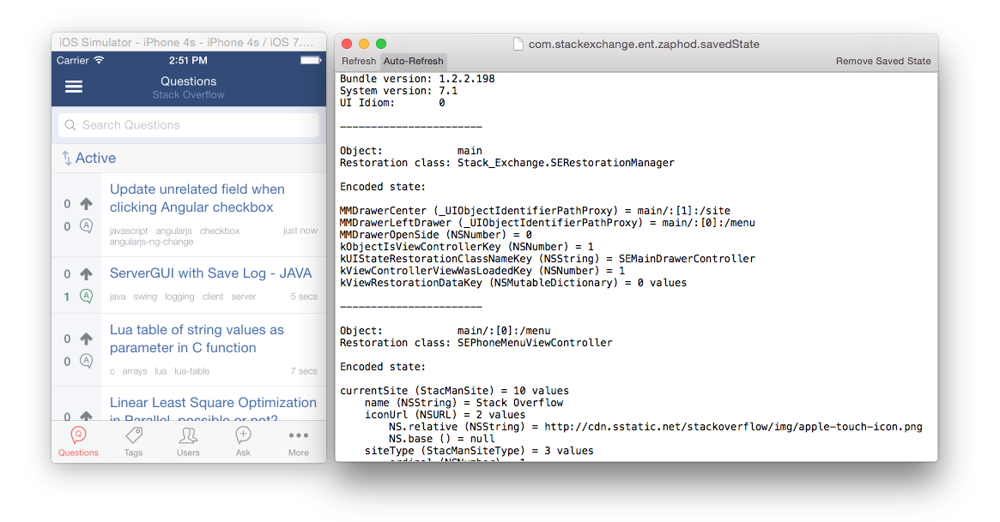

Restoration Inspector
=====================

Restororation Inspector is a utility that expands the contents of your iOS application state a readable format.  It also provides a framework `KeyedArchiveInspector.framework` if you're interested in probing the contents of keyed archives.  This can be helpful for getting a look at what's going on with your encoded objects, why the restoration order wasn't exactly what you predicted, or what exactly a restorable view is saving.

For some good information on how keyed archives look internally, see [GNUStep's NSKeyedArchiver](https://github.com/gnustep/base/blob/7e1b80bb328a2ce5c308a1f51426499b370a5acc/Source/NSKeyedArchiver.m), [Apple's CFBinaryPList](http://www.opensource.apple.com/source/CF/CF-368.28/Parsing.subproj/CFBinaryPList.c), or add ".plist" to the end of your archive file and open it up in Xcode.  Fun, fun stuff.